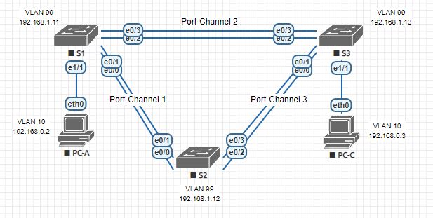
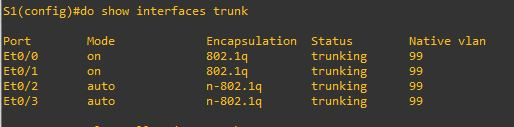
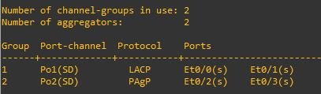
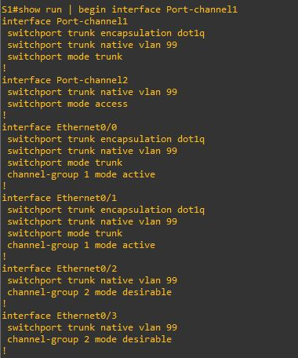
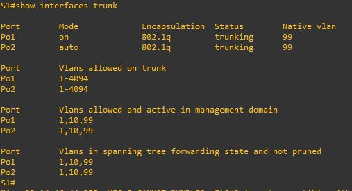
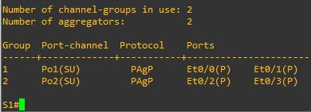

## Лабораторная работа. Поиск и устранение неполадок в работе EtherChannel

###	Топология
   

#### Таблица адресации
|Устройство|Интерфейс|IP-адрес     |Маска подсети|  
|:---------|:--------|:-----------:|:-----------:|   
|S1        |VLAN 99  |192.168.1.11 |255.255.255.0|  
|S2        |VLAN 99  |192.168.1.12 |255.255.255.0|  
|S3        |VLAN 99  |192.168.1.13 |255.255.255.0|  
|PC-A      |NIC      |192.168.0.2  |255.255.255.0|  
|PC-C      |NIC	     |192.168.0.3  |255.255.255.0|  

### Назначения сети VLAN  
|VLAN|Имя        |  
|:---|:----------|  
|10  |User       |  
|99  |Управление |  

### Задачи  
Часть 1. Построение сети и загрузка настроек устройств  
Часть 2. Отладка EtherChannel  

### Общие сведения/сценарий    
Маршрутизаторы в сети вашей компании были настроены неопытным сетевым администратором. В результате ошибок в конфигурации возникли проблемы со скоростью и подключением. Руководитель попросил вас найти и устранить неполадки в настройке и задокументировать работу. Найдите и исправьте ошибки, используя свои знания EtherChannel и стандартные методы тестирования. Убедитесь в том, что все каналы EtherChannel используют протокол агрегирования портов (PAgP) и все узлы доступны.  

##### Примечание.
 Используются коммутаторы Cisco Catalyst 2960s с Cisco IOS версии 15.0(2) (образ lanbasek9). Допускается использование других моделей коммутаторов и других версий Cisco IOS. В зависимости от модели устройства и версии Cisco IOS доступные команды и результаты их выполнения могут отличаться от тех, которые показаны в лабораторных работах.  

##### Примечание.  
 Убедитесь, что все настройки коммутатора удалены и загрузочная конфигурация отсутствует. Если вы не уверены, обратитесь к инструктору.  
	Необходимые ресурсы  
•	3 коммутатора (Cisco 2960 с операционной системой Cisco IOS 15.0(2) (образ lanbasek9) или аналогичная модель)  
•	2 ПК (Windows 7, Vista и XP с программой эмуляции терминала, например Tera Term)  
•	Консольные кабели для настройки устройств Cisco IOS через консольные порты  
•	Кабели Ethernet, расположенные в соответствии с топологией
  
## Часть 1:	Построение сети и загрузка настроек устройств  

В части 1 вам предстоит настроить топологию сети и базовые параметры для ПК, а также загрузить конфигурации на коммутаторы.  

### Шаг 1:	Создайте сеть согласно топологии.  
### Шаг 2:	Настройте узлы ПК.    
### Шаг 3:	Удалите загрузочную конфигурацию и настройки VLAN, а затем перезагрузите коммутаторы.  
### Шаг 4:	Загрузите конфигурации коммутаторов.  

Загрузите следующие конфигурации в соответствующий коммутатор. Все коммутаторы используют одинаковые пароли. Пароль привилегированного режима EXEC — class. Пароль для консоли и доступа vty — cisco. Поскольку все коммутаторы являются устройствами Cisco, сетевой администратор решил использовать протокол PAgP Cisco для всех агрегированных каналов, настроенных с использованием EtherChannel. Коммутатор S2 является корневым мостом для всех сетей VLAN в топологии.  

##### Конфигурация коммутатора S1:  
hostname S1  
interface range e0/0-3, e1/0-3  
shutdown  
exit  
enable secret class  
no ip domain lookup  
line vty 0 4  
password cisco  
login  
line con 0  
 password cisco  
 logging synchronous  
 login  
 exit  
vlan 10  
 name User  
vlan 99  
 Name Management  
interface range e0/0-1  
 switchport trunk encapsulation dot1q  
 switchport mode trunk  
 channel-group 1 mode active  
 switchport trunk native vlan 99  
 no shutdown  
interface range e0/2-3  
 channel-group 2 mode desirable  
 switchport trunk native vlan 99  
 no shutdown  
interface e1/1  
 switchport mode access  
 switchport access vlan 10  
 no shutdown  
interface vlan 99  
 ip address 192.168.1.11 255.255.255.0  
interface port-channel 1  
 switchport trunk encapsulation dot1q  
 switchport trunk native vlan 99  
 switchport mode trunk  
interface port-channel 2  
 switchport trunk native vlan 99  
 switchport mode access  
  
##### Конфигурация коммутатора S2:  
hostname S2  
interface range e0/0-3, e1/0-3  
 shutdown  
 exit  
enable secret class  
no ip domain lookup  
line vty 0 4  
 password cisco  
 login  
line con 0  
 password cisco  
 logging synchronous  
 login  
 exit  
vlan 10  
 name User  
vlan 99  
 name Management  
spanning-tree vlan 1,10,99 root primary  
interface range e0/0-1  
 switchport trunk encapsulation dot1q  
 switchport mode trunk  
 channel-group 1 mode desirable  
 switchport trunk native vlan 99  
 no shutdown  
interface range e0/2-3  
 switchport trunk encapsulation dot1q  
 switchport mode trunk  
 channel-group 3 mode desirable  
 switchport trunk encapsulation dot1q  
 switchport trunk native vlan 99  
interface vlan 99  
 ip address 192.168.1.12 255.255.255.0  
interface port-channel 1  
 switchport trunk encapsulation dot1q  
 switchport trunk native vlan 99  
 switchport trunk allowed vlan 1,99  
interface port-channel 3  
 switchport trunk encapsulation dot1q  
 switchport trunk native vlan 99  
 switchport trunk allowed vlan 1,10,99  
 switchport mode trunk  
  
##### Конфигурация коммутатора S3:  
hostname S3  
interface range e0/0-3, e1/0-3  
 shutdown  
 exit  
enable secret class  
no ip domain lookup  
line vty 0 4  
 password cisco  
 login  
line con 0  
 password cisco  
 logging synchronous  
 login  
 exit  
vlan 10  
 name User  
vlan 99  
 name Management  
interface range e0/0-1  
interface range e0/2-3  
 switchport trunk encapsulation dot1q  
 switchport mode trunk  
 channel-group 3 mode desirable  
 switchport trunk native vlan 99  
 no shutdown  
interface e1/1  
 switchport mode access  
 switchport access vlan 10  
 no shutdown  
interface vlan 99  
 ip address 192.168.1.13 255.255.255.0  
interface port-channel 3  
 switchport trunk encapsulation dot1q  
 switchport trunk native vlan 99  
 switchport mode trunk  

### Шаг 5:	Сохраните настройку.  
  
copy run st   
  
## Часть 2:	поиск и устранение неисправностей в работе EtherChannel
  
В части 2 необходимо проверить конфигурации на всех коммутаторах, исправить при необходимости и проверить их работоспособность.  

### Шаг 1:	Выполните поиск и устранение неполадок в работе маршрутизатора S1.  

a.	Используйте команду show interfaces trunk, чтобы убедиться в том, что агрегированные каналы работают, как транковые порты.  

Отображаются ли агрегированные каналы 1 и 2, как транковые порты? *ДА*  

 
b.	Используйте команду show etherchannel summary, чтобы убедиться в том, что интерфейсы входят в состав соответствующего агрегированного канала, применен правильный протокол и интерфейсы задействованы.

Есть ли в выходных данных сведения о неполадках в работе EtherChannel? В случае обнаружения неполадок запишите их в отведённом ниже месте.  

   
*1) Вместо требуемой по условию агрегации PAgP на Po2  используется LACP*  
*2) Оба Po находятся в выключенном состоянии*  
  
c.	Используйте команду show run | begin interface Port-channel для просмотра текущей конфигурации, начиная с первого интерфейса агрегированного канала. 

 
 
d.	Устраните все ошибки, найденные в выходных данных из предыдущих команд show. Запишите команды, используемые для исправления конфигураций.  
*interface range e0/0-1*
*no channel-group 1 mode active*  
*channel-group 1 mode desirable*  
  
*interface range e0/2-3*  
*switchport trunk encapsulation dot1q*  
*interface Port-channel2*  
*switchport trunk encapsulation dot1q*    
*switchport mode trunk*     
  
*interface Vlan99*    
*no shutdown*    

e.	Используйте команду show interfaces trunk для проверки настроек транковой связи.    

 
f.	Используйте команду show etherchannel summary, чтобы убедиться в том, что агрегированные каналы работают и задействованы.  

 
### Шаг 2:	Выполните поиск и устранение неполадок в работе маршрутизатора S2.  

a.	Выполните команду для того, чтобы убедиться, что агрегированные каналы работают в качестве транковых портов.   Ниже запишите команду, которую вы использовали.  
*show interfaces trunk*  
   
Есть ли в выходных данных сведения о неполадках в конфигурациях? В случае обнаружения неполадок запишите их в отведённом ниже месте.  
   
Не отображается Po3  
*Int range e0/2-3*    
*No shutdown*    
  
Po3 не поднят на S3 и не добавлен VLAN 10  
*interface Vlan99*  
*no shutdown*  
*interface Po1*  
*switchport trunk allowed vlan 1,10,99*  
  
b.	Выполните команду, чтобы убедиться в том, что интерфейсы настроены в правильном агрегированном канале и настроен соответствующий протокол.  
Есть ли в выходных данных сведения о неполадках в работе EtherChannel? В случае обнаружения неполадок запишите.    
*show etherchannel summary*   
 

Po3 не поднят

c.	Используйте команду show run | begin interface Port-channel для просмотра текущей конфигурации, начиная с первого интерфейса канала порта.
 
d.	Выполните команду для проверки параметров транковой связи.

 
e.	Выполните команду для проверки правильного функционирования агрегированных каналов. Помните, что проблемы с агрегированным каналом могут возникнуть на любом конце канала.
 
Шаг 3:	Выполните поиск и устранение неполадок в работе маршрутизатора S3.
a.	Выполните команду для того, чтобы убедиться, что агрегированные каналы работают в качестве транковых портов.
 
Есть ли в выходных данных сведения о неполадках в конфигурациях? В случае обнаружения неполадок запишите их в отведённом ниже месте.
Нет Po2
 
Не на тех портах создан Po3
b.	Выполните команду, чтобы убедиться в том, что интерфейсы настроены в правильном агрегированном канале и применен соответствующий протокол.
 
Есть ли в выходных данных сведения о неполадках в работе EtherChannel? В случае обнаружения неполадок запишите их в отведённом ниже месте.
Ошибки выше описывал
c.	Используйте команду show run | begin interface Port-channel для просмотра текущей конфигурации, начиная с первого интерфейса агрегированного канала.
 
d.	Устраните все обнаруженные неполадки. Запишите команды, использованные для исправления конфигурации.
interface Vlan99
no shutdown

interface range e0/2-3
no channel-group 3 mode desirable
channel-group 2 mode desirable
switchport trunk native vlan 99
switchport trunk encapsulation dot1q
switchport mode trunk

interface range e0/0-1
channel-group 3 mode desirable

interface  Port-channel3
switchport trunk native vlan 99
switchport trunk encapsulation dot1q
switchport mode trunk
e.	Выполните команду для проверки параметров транковой связи. Ниже запишите команду, которую вы использовали.
show interfaces trunk 
 
f.	Выполните команду для проверки правильного функционирования агрегированных каналов. Ниже запишите команду, которую вы использовали.
show etherchannel summary 
 
Шаг 4:	Проверка EtherChannel и подключения
a.	Используйте команду show interfaces etherchannel для проверки работоспособности агрегированных каналов.
 
 
 
b.	Проверьте подключение сети VLAN Management.
Успешно ли выполняется эхо-запрос от коммутатора S1 на коммутатор S2? ДА
Успешно ли выполняется эхо-запрос от коммутатора S1 на коммутатор S3? ДА
Успешно ли выполняется эхо-запрос от коммутатора S2 на коммутатор S3? ДА
c.	Проверьте подключения компьютеров.
Успешно ли выполняется эхо-запрос от узла ПК A на узел ПК C?  ДА
Если каналы EtherChannel не полностью работоспособны, отсутствует соединение между коммутаторами или между узлами. Выполните окончательную отладку.
Примечание. Для успешной передачи эхо-запросов между компьютерами может потребоваться отключение межсетевого экрана.
