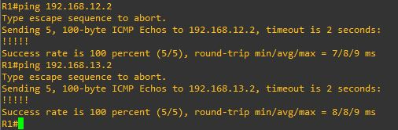
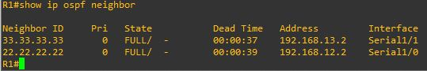
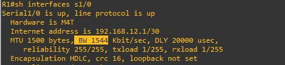

## Лабораторная работа. Настройка базового протокола OSPFv2 для одной области

### Топология
 

 
#### Таблица адресации  
|Устройство|Интерфейс |IP-адрес     |Маска подсети  |Шлюз по умолчанию|    
|:---------|:-------- |:-----------:|:-------------:|:---------------:|      
|R1        |E0/0      |192.168.1.1  |255.255.255.0  |—                |  
|R1        |S1/0      |192.168.12.1 |255.255.255.252|—                |  
|R1        |S1/1	  |192.168.13.1 |255.255.255.252|—                |    
|R2        |E0/0      |192.168.2.1  |255.255.255.0  |—                |  
|R2        |S1/0      |192.168.12.2 |255.255.255.252|—                |  
|R2        |S1/1      |192.168.23.1 |255.255.255.252|—                |   
|R3        |E0/0      |192.168.3.1  |255.255.255.0  |—                |  
|R3        |S1/0      |192.168.13.2 |255.255.255.252|—                |  
|R3        |S1/1      |192.168.23.2 |255.255.255.252|—                |  
|PC-A      |NIC       |192.168.1.3  |255.255.255.0  |192.168.1.1      |  
|PC-B      |NIC       |192.168.2.3  |255.255.255.0  |192.168.2.1      |  
|PC-C      |NIC       |192.168.3.3  |255.255.255.0  |192.168.3.1      |  

### Задачи    
Часть 1. Создание сети и настройка основных параметров устройства  
Часть 2. Настройка и проверка маршрутизации OSPF  
Часть 3. Изменение назначений идентификаторов маршрутизаторов  
Часть 4. Настройка пассивных интерфейсов OSPF  
Часть 5. Изменение метрик OSPF  

### Общие сведения/сценарий.  

Алгоритм кратчайшего пути (OSPF) — это протокол маршрутизации для IP-сетей на основе состояния канала. OSPFv2 определен для сетей протокола IPv4, а OSPFv3 — для сетей IPv6. OSPF обнаруживает изменения в топологии, например сбой канала, и быстро сходится в новой беспетлевой структуре маршрутизации. OSPF рассчитывает каждый маршрут с помощью алгоритма Дейкстры, т. е. алгоритма кратчайшего пути.  
В этой лабораторной работе необходимо настроить топологию сети с маршрутизацией OSPFv2, изменить назначения идентификаторов маршрутизаторов, настроить пассивные интерфейсы, настроить метрики OSPF и использовать ряд команд интерфейса командной строки для вывода и проверки данных маршрутизации OSPF.  

##### Примечание.
 В практических лабораторных работах CCNA используются маршрутизаторы с интегрированными сетевыми сервисами (ISR) Cisco 1941 с операционной системой Cisco IOS версии 15.2(4)M3 (образ universalk9). Допускается использование маршрутизаторов других моделей, а также других версий операционной системы Cisco IOS. В зависимости от модели устройства и версии Cisco IOS доступные команды и результаты их выполнения могут отличаться от тех, которые показаны в лабораторных работах. Точные идентификаторы интерфейсов см. в сводной таблице по интерфейсам маршрутизаторов в конце лабораторной работы.  

##### Примечание.
 Убедитесь, что все настройки маршрутизаторов удалены и загрузочная конфигурация отсутствует. Если вы не уверены, обратитесь к инструктору.

#### Необходимые ресурсы

•	3 маршрутизатора (Cisco 1941 с операционной системой Cisco IOS версии 15.2(4)M3 (универсальный образ) или аналогичная модель)  
•	3 ПК (Windows и программа эмуляции терминала, такая как Tera Term)  
•	Консольные кабели для настройки устройств Cisco IOS через консольные порты  
•	Кабели Ethernet и последовательные кабели согласно топологии  

## Часть 1:	Создание сети и настройка основных параметров устройства  

В части 1 вам предстоит создать топологию сети и настроить базовые параметры для ПК и маршрутизаторов.

### Шаг 1:	Создайте сеть согласно топологии.  
### Шаг 2:	Выполните запуск и перезагрузку маршрутизаторов.  
### Шаг 3:	Произведите базовую настройку маршрутизаторов.
  
a.	Отключите DNS-поиск.  
*no ip domain-lookup*  
b.	Настройте имена устройств в соответствии с топологией.  
*Hostname R1*  
c.	Назначьте class в качестве пароля привилегированного режима EXEC.  
*enable secret class*  
    Назначьте cisco в качестве паролей консоли и VTY.  
*line con 0*  
*password cisco*    
*login*    
*line vty 0 4*  
*password cisco*  
*login*   
d.	Настройте баннерное сообщение дня (MOTD) для предупреждения пользователей о запрете несанкционированного доступа.  
*banner motd “This is a secure system. Authorized Access Only!”*  
Настройте logging synchronous на линии консоли.   
*line con 0*  
*logging synchronous*  
Назначьте IP-адреса всем интерфейсам в соответствии с таблицей адресации.   
*int E0/0*  
*ip address 192.168.1.1 255.255.255.0*  
*no sh*  
*int S1/0*  
*ip address 192.168.12.1 255.255.255.252*  
*no sh*  
*int S1/1*  
*ip address 192.168.13.1 255.255.255.252*  
*no sh*  
e.	Настройте тактовую частоту на всех последовательных интерфейсах DCE на 128000.   
*clock rate 128000*  
Скопируйте текущую конфигурацию в файл загрузочной конфигурации.  
*copy running-config startup-config*  

### Шаг 4:	Настройте узлы ПК.
  
ip 192.168.1.3/24 192.168.1.1  

### Шаг 5:	Проверьте связь.

Маршрутизаторы должны успешно отправлять эхо-запросы друг другу, и все ПК должны успешно отправлять эхо-запросы на свои шлюзы по умолчанию. Компьютеры не могут отправлять эхо-запросы другим ПК, пока не настроена маршрутизация OSPF. При неудачном выполнении эхо-запросов выполните поиск и устранение неполадок.  
 

## Часть 2:	Настройка и проверка маршрутизации OSPF

В части 2 вам предстоит настроить маршрутизацию OSPFv2 на всех маршрутизаторах в сети, а затем убедиться, что таблицы маршрутизации правильно обновляются.  

### Шаг 1:	Настройте протокол OSPF на маршрутизаторе R1. 

a.	Используйте команду router ospf в режиме глобальной конфигурации, чтобы включить протокол OSPF на маршрутизаторе R1.  
R1(config)# router ospf 1  

##### Примечание. Идентификатор процесса OSPF хранится локально и не имеет отношения к другим маршрутизаторам в сети.  

b.	Настройте инструкции network для сетей на маршрутизаторе R1. Используйте идентификатор области, равный 0.  
R1(config-router)# network 192.168.1.0 0.0.0.255 area 0  
R1(config-router)# network 192.168.12.0 0.0.0.3 area 0  
R1(config-router)# network 192.168.13.0 0.0.0.3 area 0  

### Шаг 2:	Настройте OSPF на маршрутизаторах R2 и R3.  

Воспользуйтесь командой router ospf и добавьте инструкции network для сетей на маршрутизаторах R2 и R3. Когда маршрутизация OSPF будет настроена на R2 и R3, на маршрутизаторе R1 будут появятся сообщения об отношениях смежности.
  
 
### Шаг 3:	Проверьте информацию о соседних устройствах и маршрутизации OSPF.

a.	Выполните команду show ip ospf neighbor, чтобы убедиться, что на каждом маршрутизаторе другие маршрутизаторы сети указаны в качестве соседних устройств.  
R1# show ip ospf neighbor  

 
b.	Введите команду show ip route, чтобы убедиться, что все сети отображаются в таблице маршрутизации на всех маршрутизаторах. 
   
Какую команду вы бы применили, чтобы просмотреть в таблице маршрутизации только маршруты OSPF?  
*show ip route ospf*  
 
### Шаг 4:	Проверьте параметры протокола OSPF.  

Команда show ip protocols — быстрый способ проверки важнейшей информации о конфигурации OSPF. Эта информация содержит идентификатор процесса OSPF, идентификатор маршрутизатора, объявляемые маршрутизатором сети, соседние устройства, от который маршрутизатор получает обновления, а также административную дистанцию по умолчанию, для OSPF равную 110.  
R1# show ip protocols  

### Шаг 5:	Проверьте данные процесса OSPF.  

Используйте команду show ip ospf для проверки идентификатора процесса OSPF и идентификатора маршрутизатора. Эта команда отображает данные области OSPF и показывает время последнего расчёта алгоритма SPF.  
R1# show ip ospf  
    
 
### Шаг 6:	Проверьте параметры интерфейса OSPF.  

a.	Введите команду show ip ospf interface brief для отображения сводки интерфейсов с поддержкой протокола OSPF.  
R1# show ip ospf interface brief    
  
 
b.	Для получения более подробного списка всех интерфейсов с поддержкой протокола OSPF введите команду show ip ospf interface.  
R1# show ip ospf interface  
  
 
### Шаг 7:	Проверьте наличие сквозного соединения.  

Все компьютеры должны успешно отправлять эхо-запросы ко всем остальным компьютерам, указанным в топологии. При неудачном выполнении эхо-запросов выполните поиск и устранение неполадок.  

##### Примечание.
 Для успешной передачи эхо-запросов может потребоваться отключение межсетевого экрана.  

## Часть 3:	Изменение назначенных идентификаторов маршрутизаторов  

Идентификатор OSPF-маршрутизатора используется для уникальной идентификации домена маршрутизации OSPF.   Маршрутизаторам компании Cisco идентификатор назначается одним из трех способов и в следующем порядке:  
1)	IP-адрес, настроенный с помощью команды OSPF router-id (при наличии)  
2)	Наибольший IP-адрес любого из loopback-адресов маршрутизатора (при наличии)  
3)	Наибольший активный IP-адрес любого из физических интерфейсов маршрутизатора  
Поскольку ни на одном из трех маршрутизаторов не настроены ID маршрутизатора или интерфейсы loopback, ID каждого маршрутизатора определяется наивысшим IP-адресом любого активного интерфейса.  
В части 3 вам необходимо изменить назначение идентификатора OSPF-маршрутизатора с помощью loopback-адресов. Также мы воспользуемся командой router-id для смены идентификатора маршрутизатора.  

### Шаг 1:	Измените идентификаторы маршрутизатора с помощью loopback-адресов.  

a.	Назначьте IP-адрес loopback-интерфейсу 0 для маршрутизатора R1.  
R1(config)# interface lo0  
R1(config-if)# ip address 1.1.1.1 255.255.255.255  
R1(config-if)# end  
b.	Назначьте IP-адреса loopback-интерфейсам 0 для маршрутизаторов R2 и R3. Используйте IP-адрес 2.2.2.2/32 для R2 и 3.3.3.3/32 для R3.  
c.	Сохраните текущую конфигурацию в загрузочную конфигурацию на всех трех маршрутизаторах.  
copy running-config startup-config  
d.	Чтобы восстановить для идентификатора маршрутизатора использование loopback-адреса, необходимо перезагрузить маршрутизаторы. Выполните команду reload на всех трех маршрутизаторах. Нажмите клавишу ВВОД, чтобы подтвердить перезагрузку.  
e.	После того как маршрутизатор завершит процесс перезагрузки, введите команду show ip protocols, чтобы просмотреть новый идентификатор маршрутизатора.  
R1# show ip protocols    
    
f.	Введите команду show ip ospf neighbor, чтобы просмотреть изменения идентификаторов соседних маршрутизаторов.  
R1# show ip ospf neighbor  
  
 
### Шаг 2:	Измените идентификатор маршрутизатора R1 с помощью команды router-id.  

Предпочтительным методом настройки идентификатора маршрутизатора является команда router-id.  
a.	Чтобы переназначить идентификатор маршрутизатора R1, выполните на нем команду router-id 11.11.11.11. Обратите внимание на уведомление, которое появляется при выполнении команды router-id.  
R1(config)# router ospf 1  
R1(config-router)# router-id 11.11.11.11  
Reload or use "clear ip ospf process" command, for this to take effect  
R1(config)# end  
b.	На экран будет выведено информационное сообщение о том, что необходимо либо перезагрузить маршрутизатор, либо воспользоваться командой clear ip ospf process для вступления этого изменения в силу. Введите команду clear ip ospf process на всех трех маршрутизаторах. Введите yes, чтобы подтвердить сброс, и нажмите клавишу ВВОД.  
c.	Для маршрутизатор R2 настройте идентификатор 22.22.22.22, а для маршрутизатора R3 настройте идентификатор 33.33.33.33. Затем используйте команду clear ip ospf process для сброса процесса маршрутизации ospf.  
d.	Введите команду show ip protocols, чтобы проверить, изменился ли идентификатор на маршрутизаторе R1.  
R1# show ip protocols  
  
e.	Выполните команду show ip ospf neighbor на маршрутизаторе R1, чтобы убедиться, что новые идентификаторы для маршрутизаторов R2 и R3 содержатся в списке.  
R1# show ip ospf neighbor  

 
## Часть 4:	Настройка пассивных интерфейсов OSPF

Команда passive-interface запрещает отправку обновлений маршрутов через указанный интерфейс маршрутизатора. В большинстве случаев команда используется для уменьшения трафика в локальных сетях, поскольку им не нужно получать сообщения протокола динамической маршрутизации. В части 4 вам предстоит использовать команду passive-interface для настройки интерфейса в качестве пассивного. Также вы настроите OSPF таким образом, чтобы все интерфейсы маршрутизатора были пассивными по умолчанию, а затем включите объявления протокола маршрутизации OSPF для выбранных интерфейсов.  

### Шаг 1:	Настройте пассивный интерфейс.  
a.	Введите команду show ip ospf interface e0/0 на маршрутизаторе R1. Обратите внимание на таймер, указывающий время получения очередного пакета приветствия. Пакеты приветствия отправляются каждые 10 секунд и используются маршрутизаторами OSPF для проверки работоспособности соседних устройств.  
R1# show ip ospf interface E0/0  
   
b.	Выполните команду passive-interface, чтобы интерфейс G0/0 маршрутизатора R1 стал пассивным.  
R1(config)# router ospf 1  
R1(config-router)# passive-interface E0/0  
c.	Повторно выполните команду show ip ospf interface E0/0, чтобы убедиться, что интерфейс E0/0 стал пассивным.  
R1# show ip ospf interface E0/0  
   
d.	Введите команду show ip route на маршрутизаторах R2 и R3, чтобы убедиться, что маршрут к сети 192.168.1.0/24 остается доступным.  
R2# show ip route  

 
### Шаг 2:	Настройте на маршрутизаторе пассивный интерфейс в качестве интерфейса по умолчанию.  

a.	Выполните команду show ip ospf neighbor на маршрутизаторе R1, чтобы убедиться, что R2 указан в качестве соседнего устройства OSPF.  
R1# show ip ospf neighbor  
   
b.	Введите команду passive-interface default на маршрутизаторе R2, чтобы задать настройку по умолчанию всех интерфейсов OSPF в качестве пассивных.    
R2(config)# router ospf 1  
R2(config-router)# passive-interface default  
R2(config-router)#  
  
c.	Повторно введите команду show ip ospf neighbor на маршрутизаторе R1. После истечения таймера простоя маршрутизатор R2 больше не будет указан как соседнее устройство OSPF.  
R1# show ip ospf neighbor  
  
d.	Выполните команду show ip ospf interface S1/0 на маршрутизаторе R2, чтобы просмотреть состояние OSPF для интерфейса S1/0.  
R2# show ip ospf interface s1/0  
  
e.	Если все интерфейсы маршрутизатора R2 являются пассивными, то информация маршрутизации не будет объявляться. В этом случае у маршрутизаторов R1 и R3 теперь должен отсутствовать маршрут к сети 192.168.2.0/24. Это можно проверить командой show ip route.  
   
f.	На маршрутизаторе R2 выполните команду no passive-interface, чтобы маршрутизатор отправлял и получал обновления маршрутизации OSPF. После ввода этой команды появится уведомление о том, что были установлены соседские отношения смежности с маршрутизатором R1.  
R2(config)# router ospf 1  
R2(config-router)# no passive-interface s1/0  
R2(config-router)#  
   
g.	Повторно выполните команды show ip route и show ip ospf neighbor на маршрутизаторах R1 и R3 и найдите маршрут к сети 192.168.2.0/24.   
   
  
Какой интерфейс использует R3 для маршрута к сети 192.168.2.0/24?  *S1/0 (через R1)*  
Чему равна суммарная метрика стоимости для сети 192.168.2.0/24 на R3? *[110/138]*  
Отображается ли маршрутизатор R2 как соседнее устройство OSPF на маршрутизаторе R1? *НЕТ*  
Отображается ли маршрутизатор R2 как соседнее устройство OSPF на маршрутизаторе R3? *НЕТ*   
Что дает вам эта информация? *Передается только маршрутизация сетей за роутером R2, сам роутер недоступен, то есть мы сначала добавили интерфейс и его сеть в OSPF, а затем запретили слать в него OSPF пакеты.*   
h.	Настройте интерфейс S1/1 маршрутизатора R2 так, чтобы разрешить ему объявлять маршруты OSPF. Ниже запишите используемые команды.  
router ospf 1  
no passive-interface s1/1  
i.	Повторно введите команду show ip route на маршрутизаторе R3.  
   
Какой интерфейс использует R3 для маршрута к сети 192.168.2.0/24?  
*S1/1 (через R2)*    
Чему равна суммарная метрика стоимости для сети 192.168.2.0/24 на маршрутизаторе R3?    
*[110/74] 110 это административная дистанция, 74 метрика.*    
Как она была рассчитана?  
|Тип интерфейса        |Стоимость                           |    
|:---------------------|:--------:                          |     
|FastEthernet и быстрее|10 в 8 степени / 100,000,000 bps = 1|      
|Ethernet              |10 в 8 степени / 10,000,000 bps = 10|      
|E1                    |10 в 8 степени / 2,048,000 bps = 48 |      
|T1                    |10 в 8 степени / 1,544,000 bps = 64 |     
|128 kbps              |10 в 8 степени / 128,000 bps = 781  |  
|64  kbps              |10 в 8 степени / 64,000 bps = 1562  |  
|56  kbps              |10 в 8 степени / 56,000 bps = 1785  |     
*На каждом маршрутизаторе стоимость для интерфейса вычисляется как 10 в степени 8, разделенное на пропускную способность в бит/с, при прохождении через несколько интерфейсов их метрика суммируется. Минимальная метрика считается приоритетной наши 74 получились из 64 + 10.*
Отображается ли маршрутизатор R2 как сосед OSPF для маршрутизатора R3?   
*show ip ospf neighbor*  
   
*Да*  

## Часть 5:	Изменение метрик OSPF

В части 5 необходимо изменить метрики OSPF с помощью команд auto-cost reference-bandwidth, bandwidth и ip ospf cost.  

##### Примечание.
 В части 1 на всех интерфейсах DCE нужно было установить значение тактовой частоты 128000.  

### Шаг 1:	Измените заданную пропускную способность для маршрутизаторов.  

Эталонная пропускная способность по умолчанию для OSPF равна 100 Мбит/с (скорость Fast Ethernet). Но скорость каналов в большинстве современных устройств сетевой инфраструктуры превышает 100 Мбит/c. Поскольку метрика стоимости OSPF должна быть целым числом, стоимость для всех каналов со скоростью передачи 100 Мбит/c и выше равна 1. Поэтому интерфейсы Fast Ethernet, Gigabit Ethernet и 10G Ethernet имеют одинаковую стоимость. Следовательно, для учета сетей с каналами, скорость которых превышает 100 Мбит/c, необходимо более высокое значение эталонной пропускной способности.

a.	Выполните команду show interface на маршрутизаторе R1, чтобы просмотреть значение пропускной способности по умолчанию для интерфейса E0/0.  
R1# show interface e0/0  
   
b.	Введите команду show ip route ospf на маршрутизаторе R1, чтобы определить маршрут к сети 192.168.3.0/24.   
R1# show ip route ospf  
  
 
##### Примечание.
Суммарная стоимость маршрута к сети 192.168.3.0/24 от маршрутизатора R1 равна 74.  
c.	Выполните команду show ip ospf interface на маршрутизаторе R3, чтобы определить стоимость маршрутизации для интерфейса E0/0.  
R3# show ip ospf interface e0/0  
     
Cost: 10  
d.	Выполните команду show ip ospf interface s1/1 на маршрутизаторе R1, чтобы просмотреть стоимость маршрутизации для интерфейса S1/1.  
R1# show ip ospf interface s1/1  
     
Как видно из результатов команды show ip route, сумма метрик стоимости этих двух интерфейсов является суммарной стоимостью маршрута к сети 192.168.3.0/24 для маршрутизатора R3, рассчитываемой по формуле 10 + 64 = 74.  
e.	Чтобы изменить параметр эталонной пропускной способности по умолчанию, выполните команду auto-cost reference-bandwidth 10000 на маршрутизаторе R1. С этим параметром стоимость интерфейсов 10 Гбит/с будет равна 1, стоимость интерфейсов 1 Гбит/с будет равна 10, а стоимость интерфейсов 100 Мбит/c будет равна 100.  
R1(config)# router ospf 1  
R1(config-router)# auto-cost reference-bandwidth 10000  
% OSPF: Reference bandwidth is changed.  
        Please ensure reference bandwidth is consistent across all routers.  
f.	Выполните команду auto-cost reference-bandwidth 10000 на маршрутизаторах R2 и R3.  
*Выполнено*  
g.	Повторно выполните команду show ip ospf interface, чтобы просмотреть новую стоимость интерфейса E0/0 на R3 и интерфейса S1/1 на R1.  
R3# show ip ospf interface e0/0    
     
R1# show ip ospf interface s1/1  
  
h.	Повторно введите команду show ip route ospf для просмотра новой накопленной стоимости для маршрута 192.168.3.0/24 (1000 + 6476 = 7476).    
R1# show ip route ospf    
  
 
##### Примечание.
 Изменение на маршрутизаторах эталонной пропускной способности по умолчанию с 100 на 10 000 меняет суммарные стоимости всех маршрутизаторов в 100 раз, но стоимость каждого канала и маршрута интерфейса теперь рассчитывается точнее.  
i.	Чтобы восстановить для эталонной пропускной способности значение по умолчанию, на всех трех маршрутизаторах выполните команду auto-cost reference-bandwidth 100.  
R1(config)# router ospf 1  
R1(config-router)# auto-cost reference-bandwidth 100  
% OSPF: Reference bandwidth is changed.  
        Please ensure reference bandwidth is consistent across all routers.  
Почему может понадобиться изменить эталонную пропускную способность OSPF по умолчанию?  
*Стоимость интерфейсов выше FastEthernet  будет иметь одинаковую стоимость равную 1. Для соответствия учета реально приоритетных интерфейсов и более правильного расчета требуется изменение эталонной пропускной способности OSPF.*  

### Шаг 2:	Измените пропускную способность для интерфейса.

На большинстве последовательных каналов показатель пропускной способности по умолчанию будет равен 1544 Кбит/с (как для T1). Если скорость последовательного канала в действительности отличается, то для правильного расчёта стоимости маршрута в OSPF необходимо изменить значение пропускной способности, чтобы оно было равно фактической скорости.   Используйте команду bandwidth для регулирования настройки пропускной способности на том или ином интерфейсе.

##### Примечание.  
Распространенное заблуждение — предполагать, что команда bandwidth изменит физическую пропускную способность (или скорость) канала связи. Эта команда изменяет только метрику пропускной способности, используемую алгоритмом OSPF для расчёта стоимости маршрутизации, но не меняет фактическую пропускную способность (скорость) канала.  
a.	Выполните команду show interface s0/0/0 на маршрутизаторе R1, чтобы просмотреть текущую пропускную способность на интерфейсе S0/0/0. Хотя тактовая частота (скорость передачи данных) для этого интерфейса была задана равной 128 Кбит/с, пропускная способность по-прежнему показывается как 1544 Кбит/с.  
R1# show interface s1/0  
   
<выходные данные опущены>  
b.	Введите команду show ip route ospf на маршрутизаторе R1 для просмотра накопленной стоимости маршрута к сети 192.168.23.0/24 с использованием интерфейса S1/0. Обратите внимание, что к сети 192.168.23.0/24 есть два маршрута с равной стоимостью (128): один через интерфейс S1/0, а другой через S1/1.  
R1# show ip route ospf  
  
c.	Выполните команду bandwidth 128, чтобы установить для интерфейса S0/0/0 пропускную способность равной 128 Кбит/c.  
R1(config)# interface s1/0  
R1(config-if)# bandwidth 128  
d.	Повторно введите команду show ip route ospf. В таблице маршрутизации больше не показывается маршрут к сети 192.168.23.0/24 через интерфейс S1/0. Это связано с тем, что оптимальный маршрут с наименьшей стоимостью проложен через S1/1.  
R1# show ip route ospf  
   
e.	Введите команду show ip ospf interface brief. Стоимость для интерфейса S1/0 изменилась с 64 на 781, что является точным представлением стоимости скорости канала.  
R1# show ip ospf interface brief  
  
f.	Измените на маршрутизаторе R1 пропускную способность для интерфейса S1/1 на значение, равное значению для интерфейса S1/0.  
interface s1/1  
bandwidth 128  
g.	Повторно введите команду show ip route ospf для просмотра накопленной стоимости обоих маршрутов к сети 192.168.23.0/24. Обратите внимание, что к сети 192.168.23.0/24 есть два маршрута с равной стоимостью (845): один через интерфейс S1/0, а другой через S1/1.  
R1# show ip route ospf  
   
Объясните, как были рассчитаны стоимости маршрутов от маршрутизатора R1 для сетей 192.168.3.0/24 и 192.168.23.0/30.  
*Для 192.168.3.0/24   - 781 (на R1 S1/1) + 10 (на R3 e0/0) = 791*    
*Для 192.168.23.0/30 - 781 (на R1 S1/0) + 64 (на R2 S1/1) = 845*     
h.	Введите команду show ip route ospf на маршрутизаторе R3. Суммарная стоимость для сети 192.168.1.0/24 по-прежнему равна 74. В отличие от команды clock rate, команду bandwidth требуется применить на каждой стороне последовательного канала связи.  
R3# show ip route ospf  
   
i.	Выполните команду bandwidth 128 для всех остальных последовательных интерфейсов в топологии.  
Чему равна новая суммарная стоимость для сети 192.168.23.0/24 на R1? *1562*   
   
Почему?  
*Сумма стоимости интерфейсов S до сети (781 + 781) = 1562*  

### Шаг 3:	Измените стоимость маршрута.

Для расчёта стоимости канала по умолчанию OSPF использует значение пропускной способности. Но этот расчёт можно изменить, вручную задав стоимость канала с помощью команды ip ospf cost. Подобно команде bandwidth, команда ip ospf cost влияет только на ту сторону канала, где она была применена.  
a.	Введите команду show ip route ospf на маршрутизаторе R1.  
R1# show ip route ospf  
 
b.	Выполните команду ip ospf cost 1565 для интерфейса S1/1 маршрутизатора R1. Стоимость 1565 оказывается выше суммарной стоимости маршрута, проходящего через маршрутизатор R2 (1562).  
R1(config)# interface s1/1  
R1(config-if)# ip ospf cost 1565  
c.	Повторно введите команду show ip route ospf на маршрутизаторе R1, чтобы отобразить изменения, внесенные в таблицу маршрутизации. Теперь все маршруты OSPF для маршрутизатора R1 проходят через маршрутизатор R2.  
R1# show ip route ospf  

 
##### Примечание.
Изменение метрик стоимости канала с помощью команды ip ospf cost — это наиболее простой и предпочтительный способ изменения стоимости маршрутов OSPF. Помимо изменения стоимости, используя пропускную способность, у сетевого администратора могут быть другие причины для изменения стоимости маршрута. Например, предпочтение конкретного поставщика услуг или фактическая стоимость канала или маршрута в денежном выражении.  
Почему маршрут к сети 192.168.3.0/24 от маршрутизатора R1 теперь проходит через R2?  
*Сумма стоимости маршрута от R1 через R2 меньше чем напрямую c R1 к R3*  

###	Вопросы для повторения

1.	Почему так важно управлять назначением идентификатора маршрутизатора при использовании протокола OSPF?  
*Чтобы не получить проблем с одинаковыми RID.*  
*Опасно тем, что маршрутизаторы строят свое представление о топологии области на основе LSDB, в который соседи идентифицируются по их Router ID. RID должен быть уникален для каждого маршрутизатора в автономной системе. Соседство между двумя маршрутизаторами с одинаковым Router ID просто не сформируется.*  
2.	Почему в этой лабораторной работе не рассматривается процесс выбора DR/BDR?  
*Выборы DR/BDR OSPF не происходят в сетях точка-точка. Поэтому, в стандартной топологии с тремя маршрутизаторами, R1, R2 и R3 не должны выбирать DR и BDR, потому что связи между этими маршрутизаторами не являются сетями со множественным доступом. *  
3.	Почему рекомендуется настраивать интерфейс OSPF как пассивный?  
*Для предотвращения получения информации о маршрутах другими маршрутизаторами в сети. В OSPF адрес интерфейса, который настраивается как пассивный определяется как тупиковая сеть домена OSPF. OSPF информация никогда не будет ни отправляться, ни приниматься через указанный интерфейс.*  
	
### Сводная таблица по интерфейсам маршрутизаторов

|Модель маршрутизатора|Интерфейс Ethernet № 1|Интерфейс Ethernet № 2|Последовательный интерфейс № 1|	|Последовательный интерфейс № 2|    
|:---------|:--------:|:-----------:|:-----------:|:-----------:|    
|1800|	Fast Ethernet 0/0 (F0/0)	|Fast Ethernet 0/1 (F0/1)	|Serial 0/0/0 (S0/0/0)	|Serial 0/0/1 (S0/0/1)|  
|1900|	Gigabit Ethernet 0/0 (G0/0)	|Gigabit Ethernet 0/1 (G0/1)	|Serial 0/0/0 (S0/0/0)	|Serial 0/0/1 (S0/0/1)|  
|2801|	Fast Ethernet 0/0 (F0/0)	|Fast Ethernet 0/1 (F0/1)	|Serial 0/1/0 (S0/1/0)	|Serial 0/1/1 (S0/1/1)|  
|2811|	Fast Ethernet 0/0 (F0/0)	|Fast Ethernet 0/1 (F0/1)	|Serial 0/0/0 (S0/0/0)	|Serial 0/0/1 (S0/0/1)|  
|2900|	Gigabit Ethernet 0/0 (G0/0)	|Gigabit Ethernet 0/1 (G0/1)	|Serial 0/0/0 (S0/0/0)	|Serial 0/0/1 (S0/0/1)|  

##### Примечание.
 Чтобы определить конфигурацию маршрутизатора, можно посмотреть на интерфейсы и установить тип маршрутизатора и количество его интерфейсов. Перечислить все варианты конфигураций для каждого класса маршрутизаторов невозможно. Эта таблица содержит идентификаторы для возможных вариантов интерфейсов Ethernet и последовательных интерфейсов на устройстве. Другие типы интерфейсов в таблице не представлены, хотя они могут присутствовать в данном конкретном маршрутизаторе. В качестве примера можно привести интерфейс ISDN BRI. Строка в скобках — это официальное сокращение, которое можно использовать в командах Cisco IOS для обозначения интерфейса.

