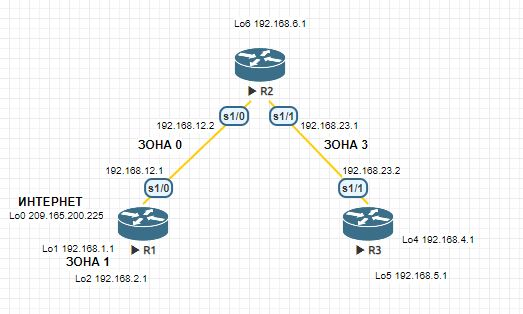
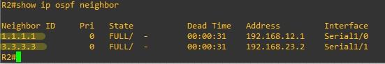
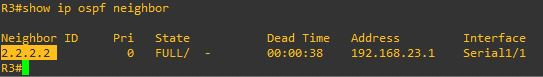
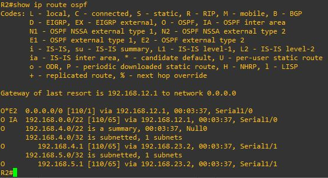
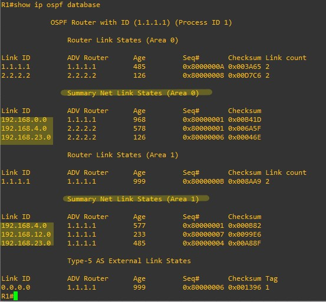
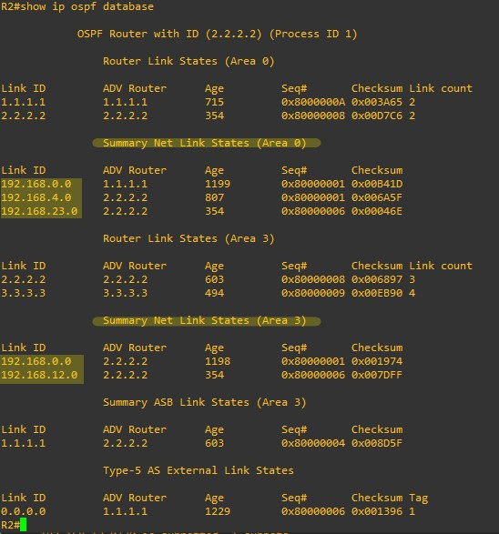

## Лабораторная работа. Настройка OSPFv2 для нескольких областей

### Топология


#### Таблица адресации  

|Устройство|Интерфейс  |IP-адрес        |Маска подсети  |  
|R1		   |Lo0        |209.165.200.225 |255.255.255.252|  
|R1        |Lo1        |192.168.1.1     |255.255.255.0  |  
|R1        |Lo2        |192.168.2.1     |255.255.255.0  |  
|R1        |S0/0/0(DCE)|192.168.12.1    |255.255.255.252|  
|R2        |Lo6        |192.168.6.1     |255.255.255.0  |  
|R2        |S0/0/0     |192.168.12.2    |255.255.255.252|  
|R2        |S0/0/1(DCE)|192.168.23.1    |255.255.255.252|  
|R3        |Lo4        |192.168.4.1     |255.255.255.0  |  
|R3        |Lo5        |192.168.5.1     |255.255.255.0  |  
|R3        |S0/0/1     |192.168.23.2    |255.255.255.252|  

### Задачи 
Часть 1. Создание сети и настройка основных параметров устройства  
Часть 2. Настройка сети OSPFv2 для нескольких областей  
Часть 3. Настройка межобластных суммарных маршрутов  

### Общие сведения/сценарий  

Для улучшения эффективности и масштабируемости в OSPF поддерживается иерархическая маршрутизация, использующая понятие областей. Область OSPF — это группа маршрутизаторов, использующих в своих базах данных состояний каналов (LSDB) общие и одинаковые данные о состоянии каналов. Если большая область OSPF разделена на области меньшего размера, такая архитектура называется OSPF для нескольких областей. Использование OSPF для нескольких областей является целесообразным в сетях большего размера, поскольку это позволяет сократить потребление ресурсов ЦП и памяти.  
В этой лабораторной работе будет выполнена настройка сети OSPFv2 для нескольких областей с межобластными суммарными маршрутами.  

##### Примечание.  
 В практических лабораторных работах CCNA используются маршрутизаторы с интегрированными сетевыми сервисами (ISR) Cisco 1941 с операционной системой Cisco IOS версии 15.2(4)M3 (образ universalk9). Допускается использование маршрутизаторов других моделей, а также других версий операционной системы Cisco IOS. В зависимости от модели устройства и версии Cisco IOS доступные команды и результаты их выполнения могут отличаться от тех, которые показаны в лабораторных работах. Точные идентификаторы интерфейсов см. в сводной таблице по интерфейсам маршрутизаторов в конце лабораторной работы.  

##### Примечание.  
 Убедитесь, что все настройки маршрутизаторов удалены и загрузочная конфигурация отсутствует. Если вы не уверены, обратитесь к инструктору.  

#### Необходимые ресурсы  

•	3 маршрутизатора (Cisco 1941 с операционной системой Cisco IOS версии 15.2(4)M3 (универсальный образ) или аналогичная модель)  
•	Консольные кабели для настройки устройств Cisco IOS через консольные порты  
•	Последовательные кабели в соответствии с топологией  

## Часть 1:	Создание сети и настройка основных параметров устройства  

В части 1 необходимо настроить топологию сети и выполнить базовые настройки маршрутизаторов.  

### Шаг 1:	Создайте сеть согласно топологии.  
### Шаг 2:	Выполните запуск и перезагрузку маршрутизаторов.  
### Шаг 3:	Произведите базовую настройку маршрутизаторов.  

a.	Отключите DNS-поиск.  
*```no ip domain-lookup```*  
b.	Задайте имя устройства в соответствии с топологией.  
*```Hostname R1```*     
c.	Назначьте class в качестве пароля привилегированного режима EXEC.  
*```enable secret class```*  
d.	Назначьте cisco в качестве паролей консоли и VTY.  
*```line con 0```*  
*```password cisco```*  
*```login```*  
*```line vty 0 4```*  
*```password cisco```*  
*```login```*  
e.	Настройте logging synchronous на линии консоли.  
*```line con 0```*  
*```logging synchronous```*    
f.	Настройте баннер MOTD (сообщение дня) для предупреждения пользователей о запрете несанкционированного доступа.  
*```banner motd ^cThis is a secure system. Authorized Access Only!^c```*  
g.	Назначьте IP-адреса всем интерфейсам в соответствии с таблицей адресации. Для интерфейсов оборудования передачи данных (DCE) следует задать тактовую частоту 128000. Пропускную способность для всех последовательных интерфейсов следует установить равной 128 Кбит/с.  
*```int E0/0```*  
*```ip address 192.168.1.1 255.255.255.0```*  
*```no sh```*  
*```int S1/0```*  
*```ip address 192.168.12.1 255.255.255.252```*  
*```clock rate 128000```*  
*```no sh```*  
*```int S1/1```*  
*```ip address 192.168.13.1 255.255.255.252```*  
*```clock rate 128000```*    
*```no sh```*  
h.	Скопируйте текущую конфигурацию в файл загрузочной конфигурации.  
*```copy running-config startup-config```*  

### Шаг 4:	Проверьте наличие подключения на уровне 3.  

Выполните команду show ip interface brief, чтобы убедиться в правильности IP-адресации и активности интерфейсов. Убедитесь, что каждый маршрутизатор может успешно отправлять эхо-запросы соседним маршрутизаторам, подключенным с помощью последовательных интерфейсов.  

    
 
## Часть 2:	Настройка сети OSPFv2 для нескольких областей  

В части 2 необходимо настроить сеть OSPFv2 для нескольких областей, используя идентификатор процесса 1. Все интерфейсы loopback локальной сети должны быть пассивными, а для всех последовательных интерфейсов должна быть настроена аутентификация MD5 с ключом Cisco123.  

### Шаг 1:	Определите типы маршрутизаторов OSPF в топологии.  

Определите магистральные маршрутизаторы: *```R1 и R2 (зона 0)```*   
Определите граничные маршрутизаторы автономной системы (ASBR):  *```R1 подключается на стыке разных автономных систем```*  
Определите граничные маршрутизаторы области (ABR): *```R2```*    
Определите внутренние маршрутизаторы: *```R3```*    

### Шаг 2:	Настройте протокол OSPF на маршрутизаторе R1.  

a.	Настройте идентификатор маршрутизатора 1.1.1.1 с идентификатором процесса OSPF 1.  
*```router ospf 1```*  
*```router-id 1.1.1.1```*  
b.	Добавьте OSPF для сетей маршрутизатора R1.  
*```R1(config-router)# network 192.168.1.0 0.0.0.255 area 1```*  
*```R1(config-router)# network 192.168.2.0 0.0.0.255 area 1```*   
*```R1(config-router)# network 192.168.12.0 0.0.0.3 area 0```*  
c.	Настройте все интерфейсы loopback локальной сети, Lo1 и Lo2, как пассивные.  
*```router ospf 1```*  
*```passive-interface lo1```*  
*```passive-interface lo2```*  
d.	Создайте маршрут по умолчанию к сети Интернет, используя выходной интерфейс Lo0.    
*```ip route 0.0.0.0 0.0.0.0 209.165.200.224```*  
   
##### Примечание.  
 Может отобразиться следующее сообщение: %Default route without gateway, if not a point-to-point interface, may impact performance (Маршрут по умолчанию настроен без шлюза, если это не интерфейс «точка-точка», производительность может снизиться). Это нормальное поведение при использовании интерфейса обратной петли для моделирования маршрута по умолчанию.  

e.	Настройте для протокола OSPF распространение маршрутов в областях OSPF.
*```router ospf 1```*  
*```default-information originate```*    

### Шаг 3:	Настройте протокол OSPF на маршрутизаторе R2.  

a.	Настройте идентификатор маршрутизатора 2.2.2.2 с идентификатором процесса OSPF 1.  
*```router ospf 1```*  
*```router-id 2.2.2.2```*  
b.	Добавьте OSPF для сетей маршрутизатора R2. Добавьте сети в соответствующую область. Запишите использованные команды в поле ниже.  
*```router ospf 1```*  
*```network 192.168.12.0 0.0.0.3 area 0```*  
*```network 192.168.23.0 0.0.0.3 area 3```*  
*```network 192.168.6.0 0.0.0.255 area 3```*    
c.	Настройте все интерфейсы loopback локальных сетей как пассивные.  
*```router ospf 1```*  
*```passive-interface lo6```* 
 
### Шаг 4:	Настройте протокол OSPF на маршрутизаторе R3.  

a.	Настройте идентификатор маршрутизатора 3.3.3.3 с идентификатором процесса OSPF 1.  
*```router ospf 1```*  
*```router-id 3.3.3.3```*  
b.	Добавьте OSPF для сетей маршрутизатора R3. Запишите использованные команды в поле ниже.  
*```router ospf 1```*  
*```network 192.168.23.0 0.0.0.3 area 3```*  
*```network 192.168.4.0 0.0.0.255 area 3```*  
*```network 192.168.5.0 0.0.0.255 area 3```*  
c.	Настройте все интерфейсы loopback локальных сетей как пассивные.  
*```router ospf 1```*    
*```passive-interface lo4```*  
*```passive-interface lo5```*  

### Шаг 5:	Убедитесь в правильности настройки протокола OSPF и в установлении отношений смежности между маршрутизаторами.  

a.	Выполните команду show ip protocols , чтобы проверить параметры OSPF на каждом маршрутизаторе. Используйте эту команду, чтобы определить типы маршрутизаторов OSPF и сети, назначенные каждой области.  
R1# show ip protocols  
 
R2# show ip protocols   
  
R3# show ip protocols    
  
  
К какому типу маршрутизаторов OSPF относится каждый маршрутизатор?  
*R1: Autonomous System Boundary Router (граничный маршрутизатор автономной системы, ASBR) — роутер, на котором помимо OSPF имеется связь с другими автономными системами (другие протоколы маршрутизации или другой OSPF-процесс)*  
*R2: Area Border Router (граничный маршрутизатор области, ABR) — роутер, находящийся на границе OSPF-области и соединяющий между собой две OSPF-области и более*  
*R3: Internal Router (внутренний маршрутизатор, IR) — роутер, находящийся внутри какой-либо OSPF-области и имеющим связь только с роутерами этой же области*  
  
b.	Введите команду show ip ospf neighbor, чтобы убедиться в установлении отношений смежности OSPF между маршрутизаторами.  
R1# show ip ospf neighbor  
  
R2# show ip ospf neighbor    
  
R3# show ip ospf neighbor  
    

c.	Введите команду show ip ospf interface brief, чтобы отобразить сводку стоимости маршрутов интерфейсов.  
R1# show ip ospf interface brief  
   
R2# show ip ospf interface brief  
   
R3# show ip ospf interface brief    
   

### Шаг 6:	Настройте аутентификацию MD5 для всех последовательных интерфейсов.  

Настройте аутентификацию MD5 для OSPF на уровне интерфейса с ключом аутентификации Cisco123.  
На R2 (на всех остальный по аналогии)  
*```int s1/0```*  
*```ip ospf message-digest-key 1 md5 Cisco123```*  
*```router ospf 1```*  
*```area 0 authentication message-digest```*  
  
*```int s1/1```*  
*```ip ospf message-digest-key 1 md5 Cisco123```*  
*```router ospf 1```*  
*```area 3 authentication message-digest```*  


Почему перед настройкой аутентификации OSPF полезно проверить правильность работы OSPF?  
*Для понимания общей картины сети и правильного назначения аутентификации, без потери соседских отношений между маршрутизаторами.*  

### Шаг 7:	Проверьте восстановление отношений смежности OSPF.  

Снова введите команду show ip ospf neighbor, чтобы убедиться в восстановлении отношений смежности OSPF между маршрутизаторами после реализации аутентификации MD5. Прежде чем перейти к части 3, устраните все найденные ошибки.  
   
   
  
 
## Часть 3:	Настройка межобластных суммарных маршрутов  

OSPF не выполняет автоматическое объединение. Объединение межобластных маршрутов необходимо вручную настроить на маршрутизаторах ABR. В части 3 необходимо настроить на маршрутизаторах ABR суммарные межобластные маршруты. С помощью команд show можно будет наблюдать, каким образом объединение влияет на таблицу маршрутизации и базы данных LSDB.  

### Шаг 1:	Просмотрите таблицы маршрутизации OSPF для всех маршрутизаторов.  

a.	Введите команду show ip route ospf на маршрутизаторе R1. Для маршрутов OSPF, начинающихся в другой области, используется дескриптор (O IA), обозначающий межобластные маршруты.  
R1# show ip route ospf  
   

b.	Повторите команду show ip route ospf для R2 и R3. Запишите маршруты OSPF между областями для каждого маршрутизатора.  
R2:  
   
R3:  
  
 
### Шаг 2:	Просмотрите базы данных LSDB на всех маршрутизаторах.  

a.	Введите команду show ip ospf database на маршрутизаторе R1. Маршрутизатор ведет отдельную базу данных LSDB для каждой области, участником которой является этот маршрутизатор.  
R1# show ip ospf database    
  
   
b.	Повторите команду show ip ospf database для R2 и R3. Запишите идентификаторы каналов (Link ID) для состояний суммарных сетевых каналов (Summary Net Link State) каждой области.  
R2:  
    
R3:  
  
   
### Шаг 3:	Настройте межобластные суммарные маршруты.  

a.	Рассчитайте суммарный маршрут для сетей в области 1.  
*```192.168.0.0 255.255.252.0   (192.168.0.0/22)```*  
b.	Настройте суммарный маршрут для области 1 на маршрутизаторе R1.  
*```R1(config)# router ospf 1```*  
*```R1(config-router)# area 1 range 192.168.0.0 255.255.252.0```*  
c.	Рассчитайте суммарный маршрут для сетей в области 3. Запишите результаты.  
*```192.168.4.0 255.255.252.0   (192.168.4.0/22)```*  
d.	Настройте суммарный маршрут для области 3 на маршрутизаторе R2. Запишите использованные команды в отведённой ниже области.  
*```router ospf 1```*  
*```area 3 range 192.168.4.0 255.255.252.0```*    

### Шаг 4:	Повторно отобразите таблицы маршрутизации OSPF для всех маршрутизаторов.  
  
Выполните команду show ip route ospf на каждом маршрутизаторе. Запишите результаты для суммарных и межобластных маршрутов.  
R1:  
       
R2:  
     
R3:  
  
   
### Шаг 5:	Просмотрите базы данных LSDB на всех маршрутизаторах.  

Выполните команду show ip ospf database на каждом маршрутизаторе. Запишите идентификаторы каналов (Link ID) для состояний суммарных сетевых каналов (Summary Net Link State) каждой области.  
R1:  
   
R2:  
   
R3:  
  
 
Пакет LSA какого типа передается в магистраль маршрутизатором ABR, когда включено объединение межобластных маршрутов?    
_______________________________________________________________________________________  

### Шаг 6:	Проверьте наличие сквозного соединения.  

Убедитесь в доступности всех сетей с каждого маршрутизатора. При необходимости выполните поиск и устранение неполадок.  

  
*Все работает.*    

### Вопросы для повторения  

Какие три преимущества при проектировании сети предоставляет OSPF для нескольких областей?  
*Обеспечение иерархической маршрутизации  
•	Таблицы маршрутизации меньшего размера — меньшее число записей в таблицах маршрутизации, так как сетевые адреса могут объединяться между областями. Функция объединения маршрутов отключена по умолчанию.  
•	Снижение нагрузки, вызванной обновлениями состояния канала — минимизация требований к ресурсам процессора и памяти.  
•	Снижение частоты расчётов кратчайшего пути — локализация воздействия изменений топологии в пределах области. Таким образом, сокращается воздействие обновлений маршрутизации, так как лавинная рассылка объявлений LSA прекращается на границе области.*  

### Сводная таблица по интерфейсам маршрутизаторов  

|Модель |Ethernet № 1               |Ethernet № 2               |Serial интерфейс № 1 |Serial интерфейс № 2 |      
|:-----:|:-------------------------:|:-------------------------:|:-------------------:|:-------------------:|      
|1800   |Fast Ethernet 0/0 (F0/0)   |Fast Ethernet 0/1 (F0/1)   |Serial 0/0/0 (S0/0/0)|Serial 0/0/1 (S0/0/1)|    
|1900   |Gigabit Ethernet 0/0 (G0/0)|Gigabit Ethernet 0/1 (G0/1)|Serial 0/0/0 (S0/0/0)|Serial 0/0/1 (S0/0/1)|    
|2801   |Fast Ethernet 0/0 (F0/0)   |Fast Ethernet 0/1 (F0/1)   |Serial 0/1/0 (S0/1/0)|Serial 0/1/1 (S0/1/1)|    
|2811   |Fast Ethernet 0/0 (F0/0)   |Fast Ethernet 0/1 (F0/1)   |Serial 0/0/0 (S0/0/0)|Serial 0/0/1 (S0/0/1)|    
|2900   |Gigabit Ethernet 0/0 (G0/0)|Gigabit Ethernet 0/1 (G0/1)|Serial 0/0/0 (S0/0/0)|Serial 0/0/1 (S0/0/1)|   

##### Примечание.  
 Чтобы определить конфигурацию маршрутизатора, можно посмотреть на интерфейсы и установить тип маршрутизатора и количество его интерфейсов. Перечислить все варианты конфигураций для каждого класса маршрутизаторов невозможно. Эта таблица содержит идентификаторы для возможных вариантов интерфейсов Ethernet и последовательных интерфейсов на устройстве. Другие типы интерфейсов в таблице не представлены, хотя они могут присутствовать в данном конкретном маршрутизаторе. В качестве примера можно привести интерфейс ISDN BRI. Строка в скобках — это официальное сокращение, которое можно использовать в командах Cisco IOS для обозначения интерфейса.

