## Лабораторная работа. Базовая настройка протокола EIGRP для IPv4  

### Топология
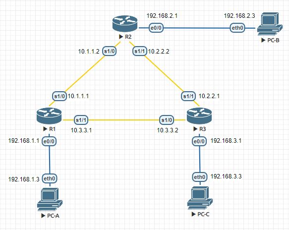  

 
#### Таблица адресации  

|Устройство|Интерфейс  |IP-адрес        |Маска подсети  |Шлюз по умолчанию|  
|:---------|:--------- |:--------------:|:-------------:|:---------------:|   
|R1        |E0/0       |192.168.1.1     |255.255.255.0  |—                |  
|R1        |S1/0(DCE)  |10.1.1.1        |255.255.255.252|—                |  
|R1        |S1/1       |10.3.3.1        |255.255.255.252|—                |  
|R2        |E0/0       |192.168.2.1     |255.255.255.0  |—                |  
|R2        |S1/0       |10.1.1.2        |255.255.255.252|—                |  
|R2        |S1/1(DCE)  |10.2.2.2        |255.255.255.252|—                |  
|R3        |E0/0       |192.168.3.1     |255.255.255.0  |—                |  
|R3        |S1/0(DCE)  |10.3.3.2        |255.255.255.252|—                |  
|R3        |S1/1       |10.2.2.1        |255.255.255.252|—                |  
|PC-A      |NIC        |192.168.1.3     |255.255.255.0  |192.168.1.1      |  
|PC-B      |NIC        |192.168.2.3     |255.255.255.0  |192.168.2.1      |  
|PC-C      |NIC        |192.168.3.3     |255.255.255.0  |192.168.3.1      |  


### Задачи  
Часть 1. Построение сети и проверка соединения  
Часть 2. Настройка маршрутизации EIGRP  
Часть 3. Проверка маршрутизации EIGRP  
Часть 4. Настройка пропускной способности и пассивных интерфейсов  

### Общие сведения/сценарий  

Протокол EIGRP — это высокопроизводительный протокол маршрутизации на основе векторов расстояния, относительно несложный при настройке для базовых сетей.  
В этой лабораторной работе необходимо настроить EIGRP для приведённых выше сетей и их топологии. Вам предстоит изменить пропускную способность и настроить пассивный интерфейс, чтобы повысить эффективность работы EIGRP. 

##### Примечание. 
 В практических лабораторных работах CCNA используются маршрутизаторы с интегрированными сетевыми сервисами (ISR) Cisco 1941 с операционной системой Cisco IOS версии 15.2(4)M3 (образ universalk9). Допускается использование маршрутизаторов других моделей, а также других версий операционной системы Cisco IOS. В зависимости от модели устройства и версии Cisco IOS доступные команды и результаты их выполнения могут отличаться от тех, которые показаны в лабораторных работах. Точные идентификаторы интерфейсов см. в сводной таблице по интерфейсам маршрутизаторов в конце лабораторной работы.
  
##### Примечание. 
 Убедитесь, что все настройки маршрутизаторов удалены и загрузочная конфигурация отсутствует. Если вы не уверены, обратитесь к инструктору.  

#### Необходимые ресурсы  
•	3 маршрутизатора (Cisco 1941 с операционной системой Cisco IOS версии 15.2(4)M3 (универсальный образ) или аналогичная модель)  
•	3 ПК (Windows 7, Vista или XP с программой эмуляции терминала, например Tera Term)  
•	Консольные кабели для настройки устройств Cisco IOS через консольные порты  
•	Кабели Ethernet и последовательные кабели согласно топологии  

## Часть 1:	Построение сети и проверка связи  

В части 1 вы настроите топологию сети и такие базовые параметры, как IP-адреса интерфейсов, доступ к устройствам и пароли.  

### Шаг 1:	Создайте сеть согласно топологии.  
### Шаг 2:	Настройте узлы ПК.  
### Шаг 3:	Выполните запуск и перезагрузку маршрутизаторов.  
### Шаг 4:	Произведите базовую настройку маршрутизаторов.  

a.	Отключите DNS-поиск.  
*```no ip domain-lookup```*  
b.	Настройте IP-адреса для маршрутизаторов в соответствии с таблицей адресации.  
Для R1 (остальные аналогично).   
*```int E0/0```*  
*```ip address 192.168.1.1 255.255.255.0```*  
*```no sh```*  
*```int S1/0```*  
*```ip address 10.1.1.1 255.255.255.252```*  
*```clock rate 128000```*  
*```no sh```*  
*```int S1/1```*  
*```ip address 10.3.3.1 255.255.255.252```*  
*```clock rate 128000```*  
*```no sh```*  
c.	Настройте имена устройств в соответствии с топологией.   
*```Hostname R1```*  
d.	Назначьте cisco в качестве паролей консоли и VTY.  
*```line con 0```*  
*```password cisco```*  
*```login```*  
*```line vty 0 4```*  
*```password cisco```*  
*```login```*  
e.	Назначьте class в качестве пароля доступа к привилегированному режиму EXEC.   
*```enable secret class```*  
f.	Настройте logging synchronous, чтобы сообщения консоли и сообщения VTY не препятствовали вводу команд.   
*```line con 0```*  
*```logging synchronous```*    
g.	Настройте сообщение дня.      
*```banner motd #Unauthorized access to this device is prohibited!#```*  
h.	Скопируйте текущую конфигурацию в файл загрузочной конфигурации.  
*```copy running-config startup-config```*
  
### Шаг 5:	Проверьте подключение.
  
Маршрутизаторы должны успешно отправлять эхо-запросы друг другу, и все ПК должны успешно отправлять эхо-запросы на свои шлюзы по умолчанию. Компьютеры не смогут отправлять эхо-запросы другим компьютерам, пока не будет настроена маршрутизация EIGRP. При неудачном выполнении эхо-запросов выполните поиск и устранение неполадок.  

## Часть 2:	Настройка маршрутизации EIGRP  

### Шаг 1:	Включите маршрутизацию EIGRP на маршрутизаторе R1. Используйте номер автономной системы 10.

R1(config)# router eigrp 10  

### Шаг 2:	Объявите напрямую подключенные сети на маршрутизаторе R1, используя шаблонную маску.  

R1(config-router)# network 10.1.1.0 0.0.0.3  
R1(config-router)# network 192.168.1.0 0.0.0.255  
R1(config-router)# network 10.3.3.0 0.0.0.3  

Почему рекомендуется использовать шаблонные маски при объявлении сетей?   
*Шаблонная маска предназначена выполнять роль указателя, она указывает на IP адреса отдельно взятой подсети, которые необходимо обработать.*
Можно ли исключить маску в какой-нибудь из вышеприведённых инструкций network?  
*да, в данном примере можно исключить хоть у всех трех. Протокол поднимется на интерфейсах относящихся к сети, только сеть 10.1.1.0 без маски запишется как 10.0.0.0 и сеть 10.3.3.0 в нее войдет, а 192.168.1.0 и так пропишется без маски.*  
Если да, то в какой (в каких)?  
*во всех*  

### Шаг 3:	Включите маршрутизацию EIGRP и объявите напрямую подключенные сети на маршрутизаторах R2 и R3.  

После добавления интерфейсов в процесс маршрутизации EIGRP появятся сообщения отношений смежности с соседними устройствами. В качестве примера показаны сообщения маршрутизатора R2.  
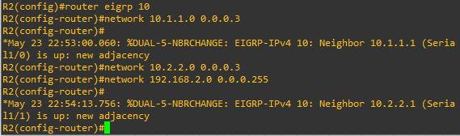   
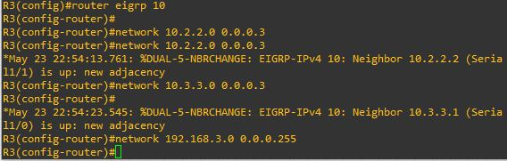 
 
### Шаг 4:	Проверьте наличие сквозного соединения.  

Если EIGRP настроен правильно, эхо-запросы между всеми устройствами должны быть успешными.  
PC-A  
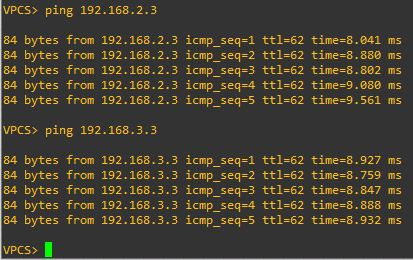   
PC-B  
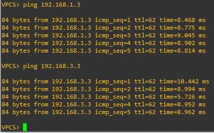   
PC-C  
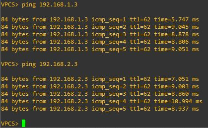  
 
##### Примечание.  
 В зависимости от операционной системы, для успешной отправки эхо-запросов на ПК может потребоваться отключить брандмауэр.  

## Часть 3:	Проверка маршрутизации EIGRP  

### Шаг 1:	Анализ таблицы соседних устройств EIGRP.  

На маршрутизаторе R1 выполните команду show ip eigrp neighbors для проверки отношений смежности, установленных с соседними маршрутизаторами.  
R1# show ip eigrp neighbors  
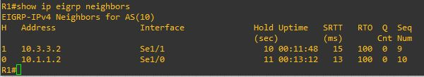   

### Шаг 2:	Проанализируйте таблицу IP-маршрутизации EIGRP.  

R1# show ip route eigrp  
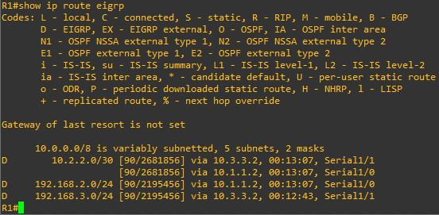  
 
Почему у маршрутизатора R1 два пути к сети 10.2.2.0/30?    
*Потому что реально есть два пути и они имеют одинаковый вес*  
  
### Шаг 3:	Проанализируйте таблицу соседних устройств EIGRP.  

R1# show ip eigrp topology  
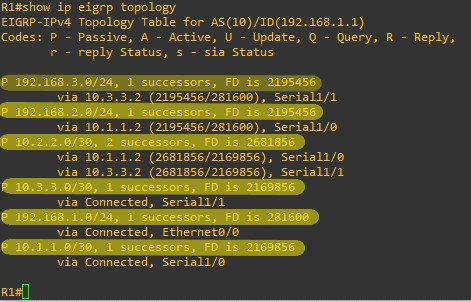  
 
Почему в таблице топологии маршрутизатора R1 отсутствуют возможные преемники?  
*У EIGRP отсутствует схема топологии сети, EIGRP является протоколом маршрутизации на основе векторов расстояний и получает информацию об удалённых сетях от своих соседних устройств.  
Маршрутизатор R2 не является возможным преемником, так как для него не выполняется условие осуществимости. Алгоритм DUAL не хранит маршрут через маршрутизатор R2 в таблице топологии. Все каналы можно просмотреть с помощью команды show ip eigrp topology all-links. Эта команда выводит для каналов сведения о том, выполняется ли для них условие осуществимости или нет.*  

### Шаг 4:	Проверьте параметры маршрутизации EIGRP и объявленные сети.  

Введите команду show ip protocols для проверки используемых параметров маршрутизации EIGRP.  
R1# show ip protocols  
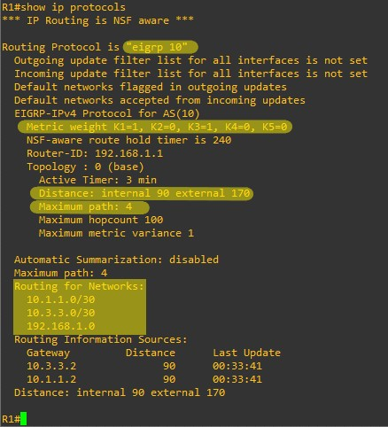  
 
Ответьте на следующие вопросы, используя результаты команды show ip protocols.  
Какой номер автономной системы используется?   
*10*  
Какие сети объявляются?   
*10.1.1.0/30, 10.3.3.0/30, 192.168.1.0*  
Каково значение административной дистанции для маршрутов EIGRP?   
*У EIGRP административное расстояние по умолчанию равно 90 для внутренних маршрутов и 170 для маршрутов, импортированных из внешнего источника, таких как маршруты по умолчанию.*  
Сколько маршрутов с равной стоимостью по умолчанию использует EIGRP?  
*По умолчанию EIGRP выполняет балансировку нагрузки между 4 маршрутами с одинаковой метрикой. Для старых версий IOS это число настраивается в диапазоне от 1 до 6. В поздних версиях количество одновременно используемых маршрутов увеличено до 16.*  
 
## Часть 4:	Настройка пропускной способности и пассивных интерфейсов  

В EIGRP используется пропускная способность по умолчанию, основанная на типе интерфейса маршрутизатора. В части 4 необходимо изменить эту пропускную способность, поскольку пропускная способность канала между маршрутизаторами R1 и R3 ниже, чем у каналов R1/R2 и R2/R3. Кроме того, необходимо настроить на каждом маршрутизаторе пассивные интерфейсы.  

### Шаг 1:	Изучите текущие настройки маршрутизации.  

a.	Введите на маршрутизаторе R1 команду show interface s1/0.  
R1# show interface s1/0  
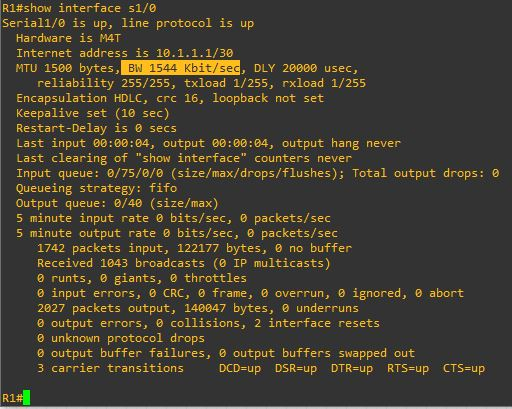  
   
Какова пропускная способность по умолчанию для этого последовательного интерфейса?  
*1544 Kbit/sec*  
b.	Сколько маршрутов к сети 10.2.2.0/30 содержит таблица маршрутизации?   
*два*  

### Шаг 2:	Измените пропускную способность на маршрутизаторах.  

a.	Измените пропускную способность для последовательных интерфейсов на маршрутизаторе R1.  

R1(config)# interface s1/0  
R1(config-if)# bandwidth 2000  
R1(config-if)# interface s1/1  
R1(config-if)# bandwidth 64  

Выполните на маршрутизаторе R1 команду show ip route. Появились ли изменения в таблице маршрутизации? Если да, в чем они заключаются?  
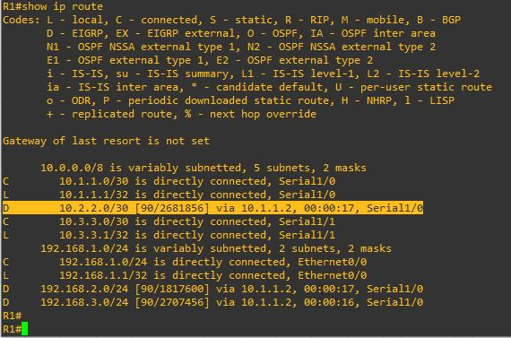  
 
*Маршрут к сети 10.2.2.0/30 стал приоритетным через интерфейс 10.1.1.2, а также обращение к сети 192.168.3.0.24 также стало доступно через интерфейс 10.1.1.2*  

b.	Измените пропускную способность для последовательных интерфейсов маршрутизаторов R2 и R3.  

R2(config)# interface s1/0  
R2(config-if)# bandwidth 2000  
R2(config-if)# interface s1/1  
R2(config-if)# bandwidth 2000  
  
R3(config)# interface s1/0  
R3(config-if)# bandwidth 64  
R3(config-if)# interface s1/1  
R3(config-if)# bandwidth 2000  

### Шаг 3:	Проверьте изменения пропускной способности.  

a.	Проверьте изменения пропускной способности. Для проверки правильности установки пропускной способности выполните на всех трех маршрутизаторах команду show interface serial 1/x, где x — это номер соответствующего последовательного интерфейса. В качестве примера показан маршрутизатор R1.  

R1# show interface s1/0  
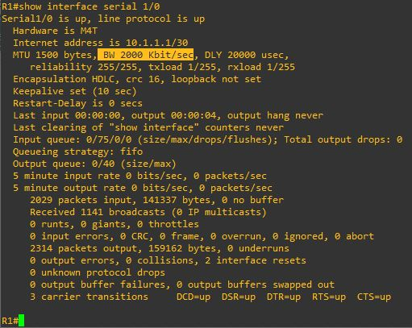  
   
Исходя из заданной пропускной способности, попробуйте определить, как будут выглядеть таблицы маршрутизации маршрутизаторов R2 и R3 до выполнения команды show ip route. Останутся ли их таблицы маршрутизации прежними или изменятся?  
*ДА останутся прежними, т.к. скорость снижена с двух сторон на 10.3.3.0 255.255.255.252*  

### Шаг 4:	Настройте на маршрутизаторах R1, R2 и R3 интерфейс E0/0 как пассивный.  

Пассивный интерфейс не позволяет передавать исходящие и входящие обновления маршрутизации через настроенный интерфейс. Команда passive-interface интерфейс заставляет маршрутизатор прекратить отправку и получение пакетов приветствия через интерфейс, но сеть, связанная с этим интерфейсом, по-прежнему будет объявляться для других маршрутизаторов через интерфейсы, не являющиеся пассивными. Интерфейсы маршрутизатора, подключенные к локальным сетям, обычно настраиваются как пассивные.  

R1(config)# router eigrp 10  
R1(config-router)# passive-interface e0/0  
  
R2(config)# router eigrp 10  
R2(config-router)# passive-interface e0/0  
  
R3(config)# router eigrp 10  
R3(config-router)# passive-interface e0/0  

### Шаг 5:	Проверьте конфигурацию пассивных интерфейсов.  

Введите на маршрутизаторах R1, R2 и R3 команду show ip protocols и убедитесь, что интерфейс E0/0 настроен как пассивный.  

R1# show ip protocols  
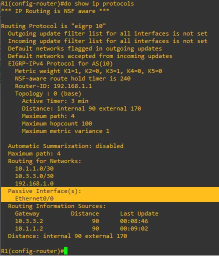  
 
### Вопросы для повторения  

При выполнении лабораторной работы можно было ограничиться только статической маршрутизацией?   
*Нет, получили бы петлю.*  
Каковы преимущества использования EIGRP?  
*Как и все бесклассовые протоколы маршрутизации, протокол EIGRP рассылает обновления маршрутной информации с масками подсетей. Это позволяет поддерживать работу с изолированными подсетями и масками подсетей переменной длины.  
Преимущества:  
–Быстрота процесса сходимости.  
–Снижение служебного трафика.  
–Совместимость между всеми протоколами и топологиями.  
–Поддержка на различных сетевых уровнях.*  

### Сводная таблица по интерфейсам маршрутизаторов  

|Модель |Ethernet № 1               |Ethernet № 2               |Serial интерфейс № 1 |Serial интерфейс № 2 |      
|:-----:|:-------------------------:|:-------------------------:|:-------------------:|:-------------------:|      
|1800   |Fast Ethernet 0/0 (F0/0)   |Fast Ethernet 0/1 (F0/1)   |Serial 0/0/0 (S0/0/0)|Serial 0/0/1 (S0/0/1)|    
|1900   |Gigabit Ethernet 0/0 (G0/0)|Gigabit Ethernet 0/1 (G0/1)|Serial 0/0/0 (S0/0/0)|Serial 0/0/1 (S0/0/1)|    
|2801   |Fast Ethernet 0/0 (F0/0)   |Fast Ethernet 0/1 (F0/1)   |Serial 0/1/0 (S0/1/0)|Serial 0/1/1 (S0/1/1)|    
|2811   |Fast Ethernet 0/0 (F0/0)   |Fast Ethernet 0/1 (F0/1)   |Serial 0/0/0 (S0/0/0)|Serial 0/0/1 (S0/0/1)|    
|2900   |Gigabit Ethernet 0/0 (G0/0)|Gigabit Ethernet 0/1 (G0/1)|Serial 0/0/0 (S0/0/0)|Serial 0/0/1 (S0/0/1)|   

##### Примечание.  
 Чтобы определить конфигурацию маршрутизатора, можно посмотреть на интерфейсы и установить тип маршрутизатора и количество его интерфейсов. Перечислить все варианты конфигураций для каждого класса маршрутизаторов невозможно. Эта таблица содержит идентификаторы для возможных вариантов интерфейсов Ethernet и последовательных интерфейсов на устройстве. Другие типы интерфейсов в таблице не представлены, хотя они могут присутствовать в данном конкретном маршрутизаторе. В качестве примера можно привести интерфейс ISDN BRI. Строка в скобках — это официальное сокращение, которое можно использовать в командах Cisco IOS для обозначения интерфейса.
	
